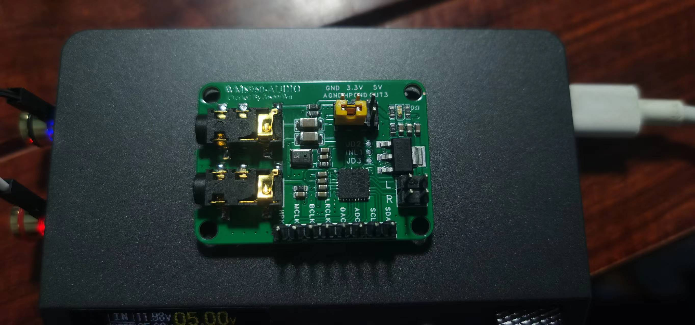

# 基于Cube的WM9860-G驱动以及模块硬件设计

**驱动已实现功能**：  
  + 支持耳机插入检测、录音、回放。
  + 仅支持播放8、16、24、32位的双/单声道.wav音频文件（暂不支持其他格式，后续加入解码库）
  + 支持播放切歌、暂停功能
  + 支持驱动两个1w扬声器外放声音  
**硬件部分**：  
  + 使用嘉立创EDA专业版设计，两层板
  + 结构紧凑，3cm X 4cm 约为两枚一元硬币大小
  + ADC_CLK与DAC_CLK引脚复用连在一起
  + 耳机音频信号输出通过条线可以改变耦合方式  

  
